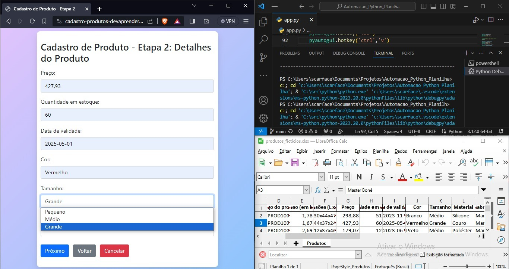

# Automacao_Python_Planilha

Passando atributos de uma planilha para um sistema de cadastro, de forma automática com Python.

Manipulando teclado e mouse com a biblioteca "pyautogui", e copiando atributos da planilha para a área de transferência do computador com "pyperclip":

